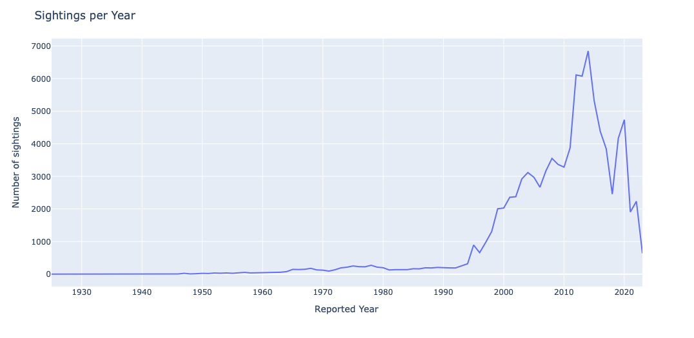
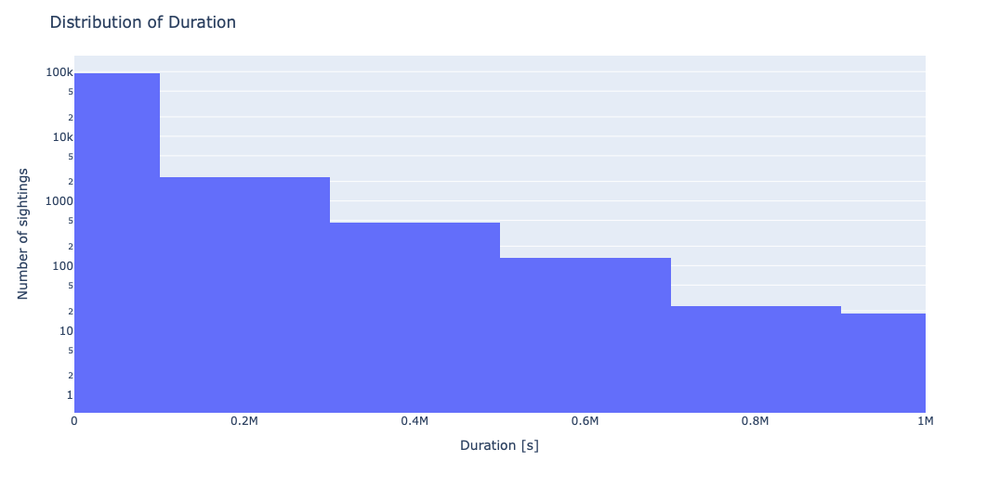

# Dataset Presentation

UFO Sightings Redux • *Giada Galdiolo, Luca Mazza, Vasco Silva Pereira*

    <a href="https://github.com/lucamazzza/spoty" target="_blank" class="slidev-icon-btn">
        <carbon:logo-github />
    </a>
    <a href="https://nbviewer.org/github/lucamazzza/ufo/blob/main/ufo.ipynb" target="_blank" class="slidev-icon-btn">
        <carbon:logo-jupyter />
    </a>

---
transition: fade-out
---

# [UFO Sightings Redux](https://github.com/rfordatascience/tidytuesday/blob/main/data/2023/2023-06-20/readme.md)

What does the dataset represent?
 
 
 

- **Row** - Each row represents a UFO Sighting (97'708)
- **Features** - Time, location, characteristics, places, day parts (35 columns)
- **Time Span** - 1925 - 2023 
- **Locations** - All USA
- **Data Source**: National UFO Reporting Center

 
 
 

---
transition: slide-up
level: 2
---

# Interesting Columns
Some interesting columns to analyze

|                                            |                                        |
|--------------------------------------------|----------------------------------------|
| **Publication/Report Date** `DateTime`     | Evolution of UFO Conception            |
| **Day Part** `Object`                      | Correlation and Frequency of day parts |
| City **State** Country Code `Object` | Geospatial Heatmap Visualization       |
| **Duration** `DateTime`                    | Find Patterns and Similarities         |

---
transition: fade-out
---

# Sightings per Year

---
transition: fade-out
---

# Distribution of sighting durations 

---
transition: slide-left
level: 2
---

# Why?
Why is this dataset interesting (to us)?

 
 
 

- UFOs are controversial 
- Analyze Reports and Find Patterns
- Identify Hoaxes
- Read some absurd stories 

 
 
 

---
layout: center
class: text-center
---

# Thank you!

[Dataset](https://github.com/rfordatascience/tidytuesday/blob/main/data/2023/2023-06-20/readme.md) · [GitHub](https://github.com/lucamazzza/ufo)

