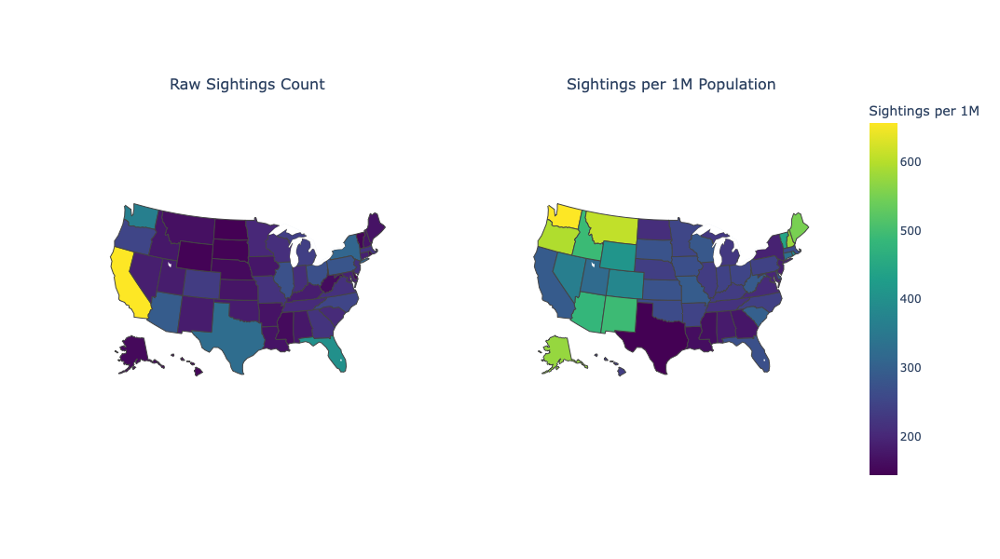
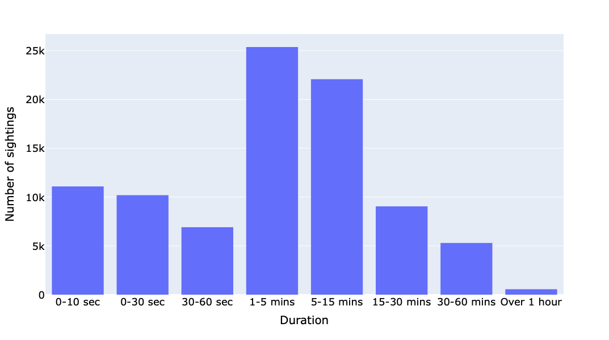
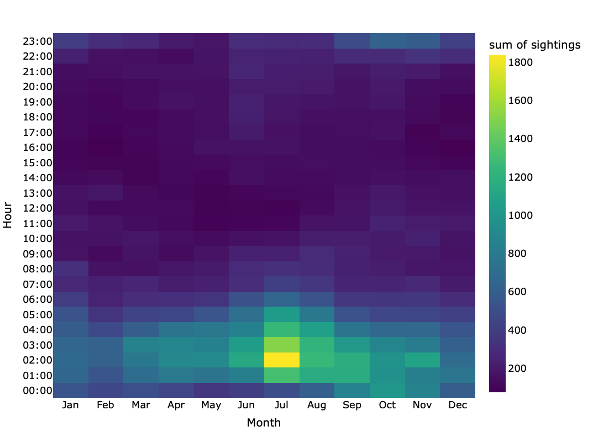
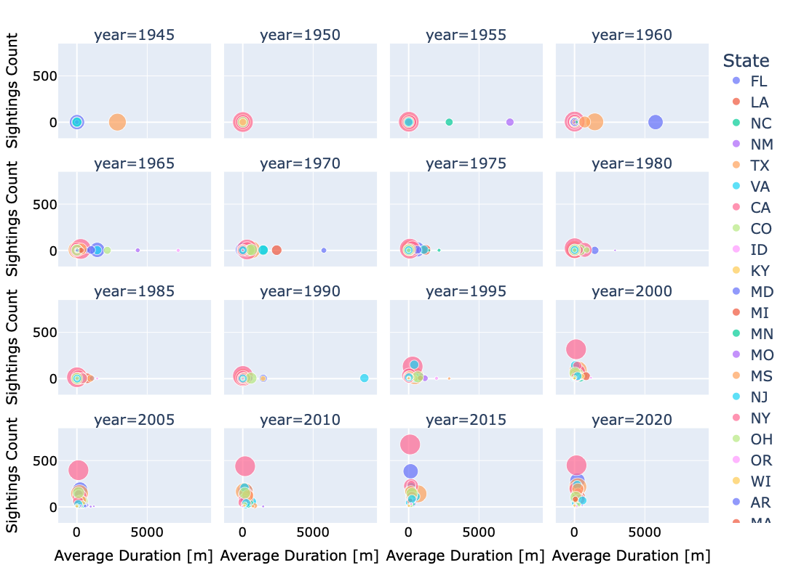

# Final Presentation

UFO Sightings Redux • *Giada Galdiolo, Luca Mazza, Vasco Silva Pereira*

    <a href="https://github.com/lucamazzza/spoty" target="_blank" class="slidev-icon-btn" style="color: #d693f9">
        <carbon:logo-github />
    </a>
    <a href="https://nbviewer.org/github/lucamazzza/ufo/blob/main/ufo.ipynb" target="_blank" class="slidev-icon-btn" style="color: #d693f9">
        <carbon:logo-jupyter />
    </a>

---

# Northwestern U.S. 

It's the region that has the higher concentration of sightings (per 1M people)

---

# Between 1 and 15 minutes

The most frequent durations

---

# What happens in July? 

A peak during summer mornings of sightings

---

# Behaviour evolves with technology

---
layout: center
class: text-center
---

# Thank you!

[Dataset](https://github.com/rfordatascience/tidytuesday/blob/main/data/2023/2023-06-20/readme.md) · [GitHub](https://github.com/lucamazzza/ufo)
