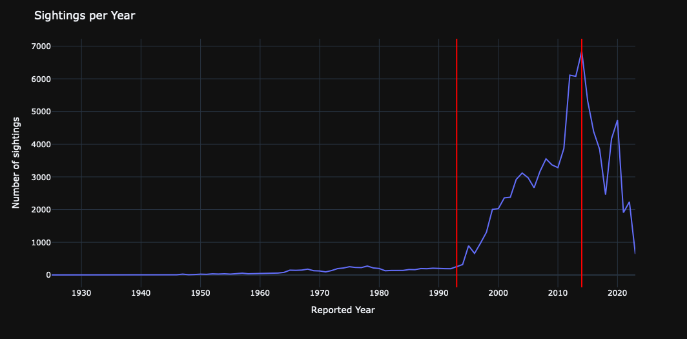
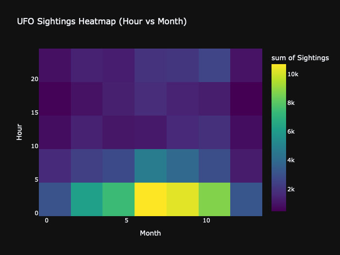

# Intermediate Presentation

UFO Sightings Redux • *Giada Galdiolo, Luca Mazza, Vasco Silva Pereira*

    <a href="https://github.com/lucamazzza/spoty" target="_blank" class="slidev-icon-btn">
        <carbon:logo-github />
    </a>
    <a href="https://nbviewer.org/github/lucamazzza/ufo/blob/main/ufo.ipynb" target="_blank" class="slidev-icon-btn">
        <carbon:logo-jupyter />
    </a>

---
transition: fade-out
---

# Sightings per Year

---
transition: fade-out
---

# Distribution of sighting durations

---
transition: fade-out
---

# Sighting per American State 

Each 1M People

---
transition: fade-out
---

# Summary Word Frequency

---
transition: fade-out
---

# Day Part Correlation 

---
layout: center
class: text-center
---

# Thank you!

[Dataset](https://github.com/rfordatascience/tidytuesday/blob/main/data/2023/2023-06-20/readme.md) · [GitHub](https://github.com/lucamazzza/ufo)

